# Android Window에 대해 공부하기

> 회사에서 최근에 버전에 따른 Keyboard, Window에 대한 이슈를 겪는데, edge to edge, cut out 이런 용어도 제대로 모르는 상태가 말이 안된다고 생각해서
> Windwow부터 차근차근 정리해보고자 한다.

## Window

### 🤔 우선 윈도우가 무엇인지부터 알고 가자.

Window는 Android에서 무언가를 그려낼 수 있는 화면이다. 코드로 보면 이렇다.

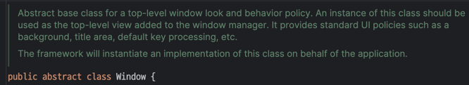

1. 애플리케이션 창의 최상단에 위치하는 뷰를 정의
2. 배경, 타이틀 영역, 기본적인 키 입력 처리 등과 같은 인터페이스 제공
3. 애플리케이션을 구현할 때 시스템 프레임워크가 이 클래스의 구체적인 구현을 자동으로 생성해서 사용한다.

1, 2번의 경우 코드를 보면 바로 알 수 있는 내용이 존재한다.

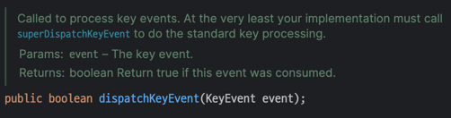

우리가 터치와 관련된 이벤트를 할 때 자주 override 하는 내용이다.   
이 코드가 Window에 존재하는 interface이며, 이 함수를 재정의해서 사용하고 있던 것이다.  
어찌보면 당연한 내용이다. Window는 최상단에 위치하는 **뷰**이기 때문이다.

그렇기에 **Window는 모든 View들이 그려진 투명한 사각형**이라고 정의할 수 있다.

### 🤔 Window와 Activity관계

- Activity는 하나 이상의 Window 객체를 가질 수 있다.
    - Dialog 같은 경우 Window를 사용하기 때문에 Activity에서 여러 Window를 갖는다는 의미
- Activity에서 `getWindow` 를 통해 `Window` 객체를 갖고 와서 조작을 한다.
    - `Window`의 풀스크린 모드 설정 등 `Window`의 표기 방식을 변경할 수 있다. -> 이 부분도 어떻게 다루는 것인지 다룰 예정

  즉 정리해보자면 Window는 Activity안에 존재하며 Activity는 여러 개의 Window를 갖기도 한다.

### 🤔 Layout Inspector로 확인하기


- decoreView가 전체를 감싸고 있다.
- statusBar와 navigationBar가 위 아래 위치한다.
- statusBar와 navigationBar를 제외한 크기 만큼이 내가 선언한 activity의 시작 layout 크기이다.

코드로 확인해보면 아래와 같다

```kotlin
val statusBarHeight = ViewCompat.getRootWindowInsets(mainView)?.getInsets(WindowInsetsCompat.Type.statusBars())?.top ?: 0
val navigationBarHeight = ViewCompat.getRootWindowInsets(mainView)?.getInsets(WindowInsetsCompat.Type.navigationBars())?.bottom ?: 0

Log.d("지훈", "decorViewHeight: ${window.decorView.measuredHeight}")
Log.d("지훈", "mainViewHeight: ${mainView.measuredHeight}")
Log.d("지훈", "statusBarHeight: $statusBarHeight || navigationBarHeight: $navigationBarHeight")
Log.d("지훈", "${mainView.measuredHeight + statusBarHeight + navigationBarHeight} == ${window.decorView.measuredHeight}")
```

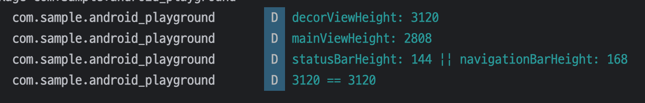

로그를 보면 알 수 있듯이 `DecorView`의 크기는 `MainView + StatusBar + NavigationBar`를 합친 값이다.

그러면 이제 Layout 계층을 봐보자.

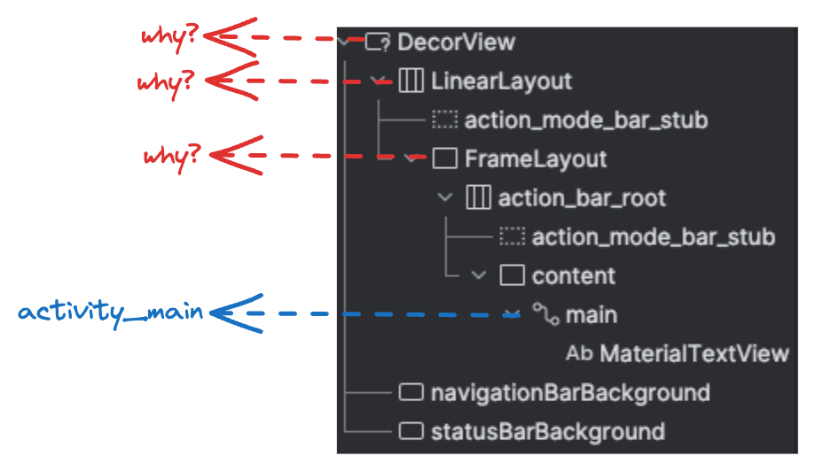

`DecorView`는 그렇다고 쳐도 `LinearLayout`, `FrameLayout` 는 넣은 적이 없는데 왜 나오는걸까?

지금 내가 알고 있는 곳은 최상단인 main이다.  
그러면 반대로 main에서부터 거꾸로 올라가면서 봐보자.

#### 1. 🧾 Activity의 setContentView

```kotlin
// MainAcitivty
override fun onCreate(savedInstanceState: Bundle?) {
    super.onCreate(savedInstanceState)
    setContentView(R.layout.activity_main)
}
```

Activity에서 setContentView를 사용해서 뷰를 세팅해준다.

```java
@Override
// AppCompatActivity
public void setContentView(@LayoutRes int layoutResID){
        initViewTreeOwners();
        // AppCompatDelegate 에게 layout을 inflate 하는 것을 위임한다.
        getDelegate().setContentView(layoutResID);
      }
```

> setContentView는 3가지가 있지만, 결국 하나로 귀결되기 때문에 굳이 다루지는 않겠습니다.

#### 2. 🧾 AppCompatDelegateImpl 의 setContentView

```java
@Override
public void setContentView(int resId){
        ensureSubDecor();
        ViewGroup contentParent=mSubDecor.findViewById(android.R.id.content);
        contentParent.removeAllViews();
        LayoutInflater.from(mContext).inflate(resId,contentParent);
        mAppCompatWindowCallback.bypassOnContentChanged(mWindow.getCallback());
        }
```

이 함수 자체만 봤을 때는 subDecor()가 제대로 install 됐는지 확인 하고 특정 동작을 하는 간단한 코드로 보인다.  
하지만 ensueSubDecor를 들어가서 내부 코드를 보면 심상치 않다.

#### 2-1. 🧾 AppCompatDelegateImpl 의 setContentView > ensureSubDecor

```java
private void ensureSubDecor(){
        if(!mSubDecorInstalled){
        mSubDecor=createSubDecor();
        // 더 많은 코드가 있지만 핵심은 subDecor가 install 돼있지 않다면 createSubDecor() 한다는 것이다.
        ...
        }
        }
```

#### 2-2. 🧾 ensureSubDecor > createSubDecor - 1  테마 스타일 속성 탐색 및 설정

```java
private ViewGroup createSubDecor(){
        TypedArray a=mContext.obtainStyledAttributes(R.styleable.AppCompatTheme);
        if(!a.hasValue(R.styleable.AppCompatTheme_windowActionBar)){
        a.recycle();
        // 테마 속성에서 AppCompatTheme_windowActionBar 가 없다면 아래와 같은 Exception을 throw하는데 가끔 봤던 오류다.
        throw new IllegalStateException("You need to use a Theme.AppCompat theme (or descendant) with this activity.");
        }
        a.recycle();
        ... // 윈도우에 필요한 기능을 요청(requestWindowFeature)  
        }
```

#### 2-2. 🧾 ensureSubDecor > createSubDecor - 2 subDecor Layout 설정

```java
// mWindowNoTitle, mIsFloating, mHasActionBar, mOverlayActionMode 등의 조건에 따라 다른 레이아웃을 로드한다.
// mWindowNoTitle은 보통 theme에서 활성화를 안하기 때문에 true 로 들어온다. 즉 여기를 볼 필요 없이 else문만 보면 된다.
if(!mWindowNoTitle){
        if(mIsFloating){
        ...
        }else if(mHasActionBar){
        ...
        }
        }else{
        // overlay 형태로 화면 위에 표시되는지에 대한 Boolean 값인데, 기본값이 false라고 생각하면 된다
        if(mOverlayActionMode){
        subDecor=(ViewGroup)inflater.inflate(R.layout.abc_screen_simple_overlay_action_mode,null);
        }else{
        subDecor=(ViewGroup)inflater.inflate(R.layout.abc_screen_simple,null);
        }
        }
```

위 코드에서 `subDecor = (ViewGroup) inflater.inflate(R.layout.abc_screen_simple, null);` 내용이 보이는데 screen_simple은 아래와 같다.

> abc가 붙어있긴 하지만 "Android Backward Compatibility"의 약자로, 안드로이드의 이전 버전과의 호환성을 위한 라이브러리에서 사용하는 접두사일뿐 무시하면된다.

[Google Git - screen_simple](https://android.googlesource.com/platform/frameworks/base/+/master/core/res/res/layout/screen_simple.xml)

```xml

<LinearLayout xmlns:android="http://schemas.android.com/apk/res/android" android:layout_width="match_parent" android:layout_height="match_parent" android:fitsSystemWindows="true"
    android:orientation="vertical">
    <ViewStub android:id="@+id/action_mode_bar_stub" android:inflatedId="@+id/action_mode_bar" android:layout="@layout/action_mode_bar" android:layout_width="match_parent"
        android:layout_height="wrap_content" android:theme="?attr/actionBarTheme" />
    <FrameLayout android:id="@android:id/content" android:layout_width="match_parent" android:layout_height="match_parent" android:foregroundInsidePadding="false"
        android:foregroundGravity="fill_horizontal|top" android:foreground="?android:attr/windowContentOverlay" />
</LinearLayout>
```

이러한 layout이 subDecor로 할당을 받으며 우리가 궁금했던 `LinearLayout`, `ViewStub`, `FrameLayout` 여기 있던 것이다.

그리고 `android:fitsSystemWindows="true"` 이 설정돼있다.

SystemBars크기 만큼 Padding 값을 갖고 View를 보여준다는 의미이다.

#### 2-3. 🧾 ensureSubDecor > createSubDecor - 3. ContentView의 자식뷰들 이동

```java
final ViewGroup windowContentView=(ViewGroup)mWindow.findViewById(android.R.id.content);
        if(windowContentView!=null){
        // 자식 뷰들이 있다면 자식뷰들 현재 contentView에 추가
        while(windowContentView.getChildCount()>0){
final View child=windowContentView.getChildAt(0);
        windowContentView.removeViewAt(0);
        contentView.addView(child);
        }
        ...
        }
```

#### 2-4. 🧾 ensureSubDecor > createSubDecor - 4. subDecor를 Window의 ContentView로 설정

```java
// 지금까지 설정했던 subDecor (R.layout_screen_simple) 을 window의 contentView로 세팅
mWindow.setContentView(subDecor);
```

#### ✅ 정리

1. Layout Inspector에서 내가 설정하지 않은 LinearLayout과 FrameLayout은 기본적인 Layout 세팅을 위해서 만들어지고 있는 것이다.
2. Activity에서 SystemBars(Navigation, Status ...) 등이 제외되던 것은 이미 상위 뷰에서 `android:fitsSystemWindows="true"` 를 세팅하고 있기 때문이다.

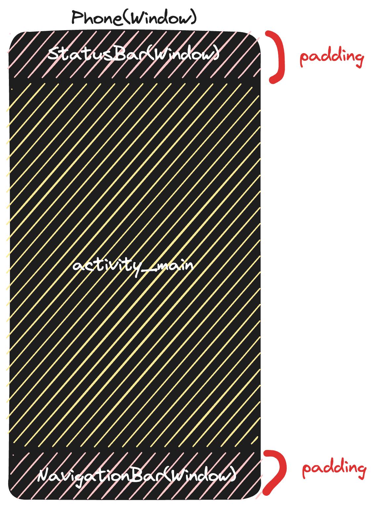

## StatusBar, Navigation 영역까지 그리기

특정 상황에서 StatusBar와 NavigationBar를 투명 처리하고 View를 그려야하는 경우가 있다.

회사 앱으로 치자면 Landscape + FullScree이 그 경우라고 할 수 있다

> targetSdk가 30 미만인 경우도 있지만 targetSdk가 30미만인 경우는 요즘 없다고 봐도 무방하니 스킵

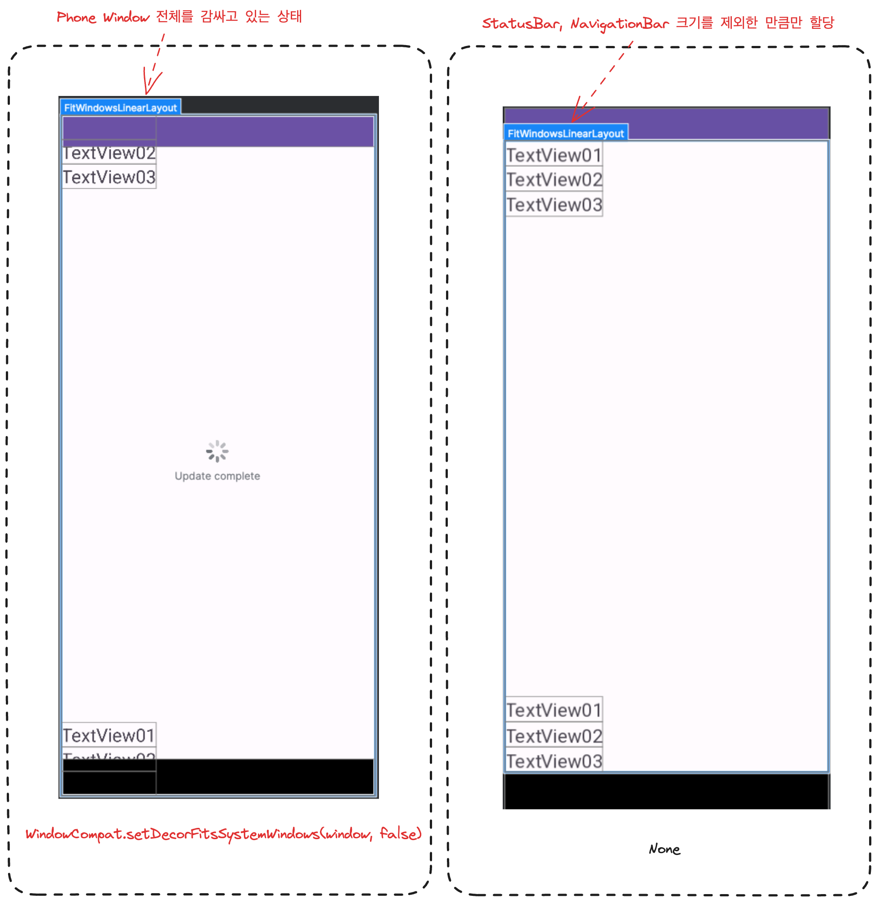

- `FitWindowsLinearLayout` 은 실제로 UI가 그려질 공간이다.
    - 위에서 `screen_simple.xml` 봤던 이 XML이라고 생각하면 편하다.
- `WindowCompat.setDecorFitsSystemWindows(window, false)` 인 경우에는 SystemBars 전체를 감싸고 있다
    - 따로 설정을 안해주면 `screen_simple.xml` 에서 `android:fitsSystemWindows="true"` 이 기본 설정이기 때문에 SystemBars 만큼 Padding이 생긴다.

#### 🤔 WindowCompat.setDecorFitsSystemWindows(window, false) 간단하게만 파보자.

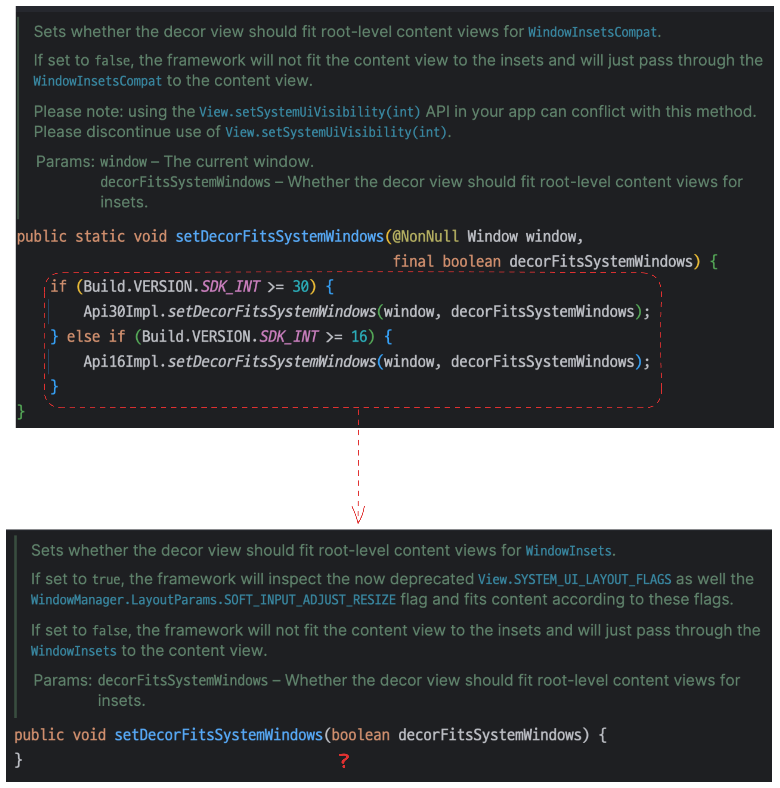

- `setDecorFitsSystemWindows` 첫 사짅을 보면 버전분기에 따라서 Impl을 다르게 해서 호출하는 모습이다.
- 그런데 2번째 사진을 보면 구현부가 아예 없는데 주석으로만 추측을 해보자.
    - true로 설정하면, 프레임워크는 이제 더 이상 사용되지 않는 `View.SYSTEM_UI_LAYOUT_FLAGS` 및 `WindowManager.LayoutParams.SOFT_INPUT_ADJUST_RESIZE` Flag를 검사하고, 이러한 Flag에 따라 콘텐츠를 맞춥니다
    - false로 설정하면, 프레임워크는 ContentView에 WindowInset을 맞추지 않고, 단순히 WindowInset을 ContentView에 전달합니다.
        - ContentView -> FitWindowsLinearLayout 과 거의 비슷하게 보면 되는데 이 View를 WindowInset 고려하지 않고 꽉차게 그린다는 의미이다.

#### 🤔 그래도 구현부를 간단하게라도 볼 수 있는 방법이 없나?

- `Window.java` 는 `abstract class`다. 결국에는 구현부가 존재한다.
- Android는 Open Source이기 때문에 https://cs.android.com/ 여기서 전부 찾을 수 있다. 찾은 결과는 아래와 같다.

[Android Code Search](https://cs.android.com/android/platform/superproject/main/+/main:frameworks/base/core/java/com/android/internal/policy/PhoneWindow.java;l=3983?q=public%20void%20setDecorFitsSystemWindows)
PhoneWindow에 있을거 같았는데 진짜로 있다.

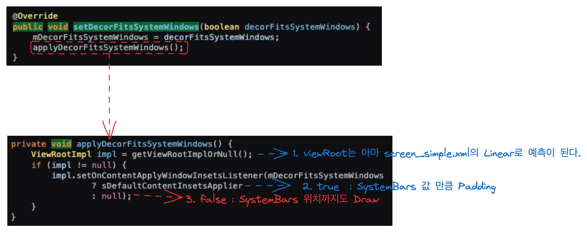

위 사진대로 보면 true / false 값에 따라 Listener에 특정 값을 넣어주는 모습이다.

- true -> `sDefaultContentInsetsApplier`
- false -> Null

이 이상 안들어가도 함수명만 보면 알 수 있다

`sDefaultContentInsetsApplier`는 `SystemBars`로부터의 `insets`을 적용하는 역할을 할거 같으며   
`insets`은 View의 내용이 `SystemBars`에 의해 가려지지 않도록 주변에 여백을 제공하게 될 것이다.

그 반대로 nul이면 아무런 `insets` 이 적용이 안될 것이라고 예상해볼 수 있다.

#### ✅ 중간 정리

- `WindowCompat.setDecorFitsSystemWindows(window, false)` 를 적용하면 꽉찬 화면을 사용할 수 있다.
- Window에서 구현이 안된 코드들을
  볼려면 [Android Code Search](https://cs.android.com/android/platform/superproject/main/+/main:frameworks/base/core/java/com/android/internal/policy/PhoneWindow.java;l=3983?q=public%20void%20setDecorFitsSystemWindows)
  를 들어가서 찾으면 된다.

### 🧾 전체화면 모드를 적용해보자.

Android에서는 총 3가지 모드가 존재하며, 각 방식의 차이점은 사용자가 시스템 표시줄을 보게 할 것인가의 차이이다. 

#### 🤔 leanback
    사용자가 영상을 시청할때 같이 화면과 거의 상호작용이 없을 때 자주 사용하는 설정이다.  
    시스템 표시줄을 다시 표시하기 위해서는 사용자는 화면 아무 곳이나 클릭하면 된다.

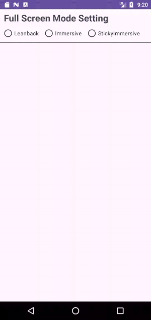

```kotlin
private val leanbackFlags = (View.SYSTEM_UI_FLAG_LAYOUT_FULLSCREEN 
        or View.SYSTEM_UI_FLAG_HIDE_NAVIGATION)
```

#### 🤔 immersive
    사용자가 화면을 탭할 때 네비게이션과 상태 바가 나타나게 합니다.
    leanback에 비해 사용자와 많이 상호작용을 할 때 사용한다.

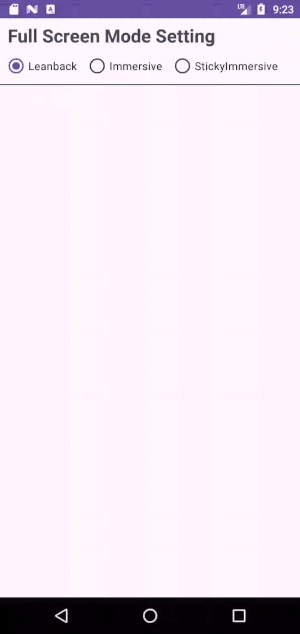

```kotlin
private val immersiveFlags = (View.SYSTEM_UI_FLAG_IMMERSIVE
            or View.SYSTEM_UI_FLAG_FULLSCREEN
            or View.SYSTEM_UI_FLAG_HIDE_NAVIGATION
            or View.SYSTEM_UI_FLAG_LAYOUT_FULLSCREEN)
```

> leanback/immersive 는 한 번이라도 탭을 하면 해당 모드가 해제 된다.

#### 🤔 sticky immersive
    네비게이션과 상태 바를 숨기지만,   
    사용자가 화면의 가장자리를 스와이프할 때 잠깐 나타났다가 자동으로 다시 숨겨집니다.

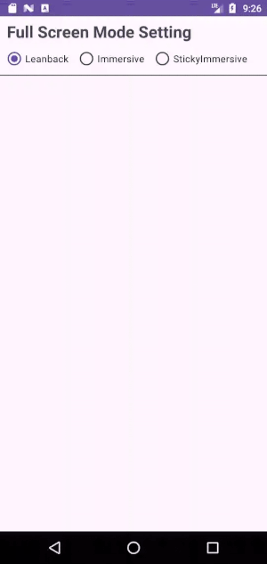

```kotlin
private val immersiveSticky = (View.SYSTEM_UI_FLAG_IMMERSIVE_STICKY
            or View.SYSTEM_UI_FLAG_FULLSCREEN
            or View.SYSTEM_UI_FLAG_HIDE_NAVIGATION
            or View.SYSTEM_UI_FLAG_LAYOUT_FULLSCREEN)
```

위 leanback / immersive 랑은 다르게 SystemBar 부분을 스와이프하면 일시적으로 표시하고 일정 시간 이후에 숨기는 특징이 있다.


## CutOut

## 참고 자료

### 공식문서

[Android-Developer-Window](https://developer.android.com/reference/android/view/Window)    
[Android-Developer-FullScreen](https://developer.android.com/develop/ui/views/layout/immersive#EnableFullscreen) -> 이거 한글문서로 보면 다 deprecated 된걸로 안내함

### 유튜브

[[DroidKnights 2019 - Track 3]안명욱 - 안드로이드 윈도우 마스터 되기](https://www.youtube.com/watch?v=q6ZC4E4lAM8&t=170s&ab_channel=DroidKnights)

### 블로그

[Android Window: Basic Concepts](https://medium.com/@MrAndroid/android-window-basic-concepts-a11d6fcaaf3f)    
[Android Window A to Z](https://medium.com/@saqwzx88/android-window-a-to-z-bed9309ea98b)  
[Deep Dive In Android Full Screen](https://soda1127.github.io/deep-dive-in-android-full-screen-1/)

