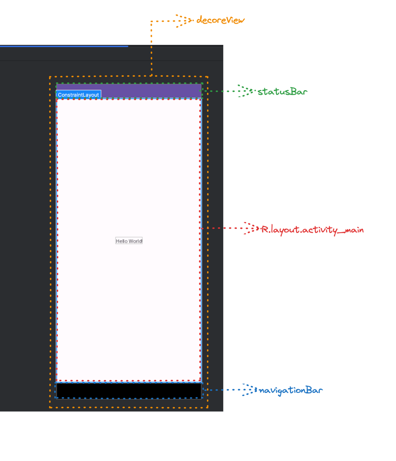

# Android Window에 대해 공부하기

> 회사에서 최근에 버전에 따른 Keyboard, Window에 대한 이슈를 겪는데, edge to edge, cut out 이런 용어도 제대로 모르는 상태가 말이 안된다고 생각해서 
> Windwow부터 차근차근 정리해보고자 한다.

## Window

### 🤔 우선 윈도우가 무엇인지부터 알고 가자.

Window는 Android에서 무언가를 그려낼 수 있는 화면이다. 코드로 보면 이렇다.


1. 애플리케이션 창의 최상단에 위치하는 뷰를 정의 
2. 배경, 타이틀 영역, 기본적인 키 입력 처리 등과 같은 인터페이스 제공
3. 애플리케이션을 구현할 때 시스템 프레임워크가 이 클래스의 구체적인 구현을 자동으로 생성해서 사용한다.

1, 2번의 경우 코드를 보면 바로 알 수 있는 내용이 존재한다.


우리가 터치와 관련된 이벤트를 할 때 자주 override 하는 내용이다.   
이 코드가 Window에 존재하는 interface이며, 이 함수를 재정의해서 사용하고 있던 것이다.  
어찌보면 당연한 내용이다. Window는 최상단에 위치하는 **뷰**이기 때문이다.

그렇기에 **Window는 모든 View들이 그려진 투명한 사각형**이라고 정의할 수 있다.

### 🤔 Window와 Activity관계

- Activity는 하나 이상의 Window 객체를 가질 수 있다. 
  - Dialog 같은 경우 Window를 사용하기 때문에 Activity에서 여러 Window를 갖는다는 의미
- Activity에서 `getWindow` 를 통해 `Window` 객체를 갖고 와서 조작을 한다.
  - `Window`의 풀스크린 모드 설정 등 `Window`의 표기 방식을 변경할 수 있다. -> 이 부분도 어떻게 다루는 것인지 다룰 예정


    즉 정리해보자면 Window는 Activity안에 존재하며 Activity는 여러 개의 Window를 갖기도 한다. 

### 🤔 Layout Inspector로 확인하기



- decoreView가 전체를 감싸고 있다.
- statusBar와 navigationBar가 위 아래 위치한다.
- statusBar와 navigationBar를 제외한 크기 만큼이 내가 선언한 activity의 시작 layout 크기이다.

> 여기서 statusBar와 navigationBar를 제외한 값을 자동으로 반영이 되는 것은 `android:fitSystemWindows=true` 값이 정의돼있기 때문이다.

코드로 확인해보면 아래와 같다

```kotlin
val statusBarHeight = ViewCompat.getRootWindowInsets(mainView)?.getInsets(WindowInsetsCompat.Type.statusBars())?.top ?: 0
val navigationBarHeight = ViewCompat.getRootWindowInsets(mainView)?.getInsets(WindowInsetsCompat.Type.navigationBars())?.bottom ?: 0

Log.d("지훈", "decorViewHeight: ${window.decorView.measuredHeight}")
Log.d("지훈", "mainViewHeight: ${mainView.measuredHeight}")
Log.d("지훈", "statusBarHeight: $statusBarHeight || navigationBarHeight: $navigationBarHeight")
Log.d("지훈", "${mainView.measuredHeight + statusBarHeight + navigationBarHeight} == ${window.decorView.measuredHeight}")
```


## StatusBar, Navigation 영역까지 그리기

## CutOut

## 참고 자료

### 공식문서
[Android-Developer](https://developer.android.com/reference/android/view/Window)

### 유튜브
[[DroidKnights 2019 - Track 3]안명욱 - 안드로이드 윈도우 마스터 되기](https://www.youtube.com/watch?v=q6ZC4E4lAM8&t=170s&ab_channel=DroidKnights)

### 블로그
[Android Window: Basic Concepts](https://medium.com/@MrAndroid/android-window-basic-concepts-a11d6fcaaf3f)    
[Android Window A to Z](https://medium.com/@saqwzx88/android-window-a-to-z-bed9309ea98b)

